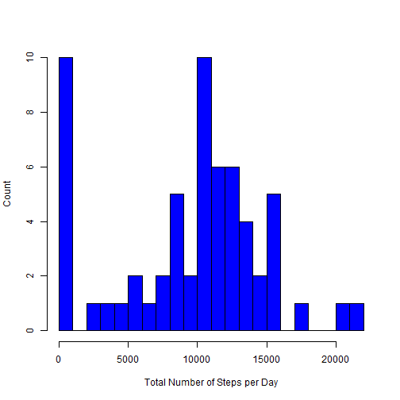
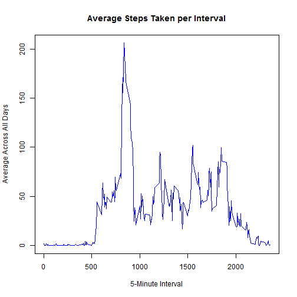
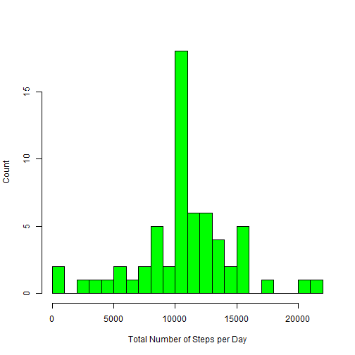
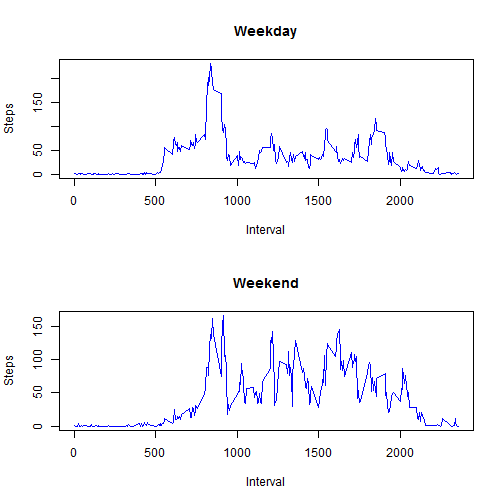

# Reproducible Research: Peer Assessment 1

### Introduction

It is now possible to collect a large amount of data about personal movement using activity monitoring devices such as a Fitbit, Nike Fuelband, or Jawbone Up. These type of devices are part of the “quantified self” movement – a group of enthusiasts who take measurements about themselves regularly to improve their health, to find patterns in their behavior, or because they are tech geeks. But these data remain under-utilized both because the raw data are hard to obtain and there is a lack of statistical methods and software for processing and interpreting the data.

This assignment makes use of data from a personal activity monitoring device. This device collects data at 5 minute intervals through out the day. The data consists of two months of data from an anonymous individual collected during the months of October and November, 2012 and include the number of steps taken in 5 minute intervals each day.

### Data

The original data for this assignment was obtained from: https://d396qusza40orc.cloudfront.net/repdata%2Fdata%2Factivity.zip

This data for this assignment was supplied from the GitHub repository (http://github.com/rdpeng/RepData_PeerAssessment1) created for this assignment as: activity.zip.  

The dataset is stored in a comma-separated-value (CSV) file and there are a total of 17,568 observations in this dataset.

**steps:** Number of steps taking in a 5-minute interval (missing values are coded as NA)

**date:** The date on which the measurement was taken in YYYY-MM-DD format

**interval:** Identifier for the 5-minute interval in which measurement was taken


## Loading and preprocessing the data

Unzip the file if it is not already uziped with the current working directory.


```r
if( !file.exists("activity.csv") ) {
   unzip(zipfile = "activity.zip")
}

activityData <- read.csv(file = "activity.csv"
                       , header = TRUE
                       , sep = ","
                       , na.strings = "NA"
                       , colClasses = c("integer","Date","integer")
                       , stringsAsFactors = FALSE)
```


## What is mean total number of steps taken per day?

Create the data needed for the total number of steps taken per day. We will remove NAs.


```r
totalSteps <- tapply(activityData$steps, activityData$date, FUN=sum, na.rm=TRUE)
```

Create a histogram of the total number of steps taken each day.


```r
hist(totalSteps
   , main = ""
   , xlab = "Total Number of Steps per Day"
   , ylab = "Count"
   , col = "blue"
   , breaks = 20)
```

 

Calculate the mean and median of the total number of steps taken per day.


```r
mean(totalSteps, na.rm=TRUE)
```

```
## [1] 9354.23
```

```r
median(totalSteps, na.rm=TRUE)
```

```
## [1] 10395
```


## What is the average daily activity pattern?

Create the data needed for the average daily activity pattern.


```r
stepAverage <- aggregate(steps ~ interval, activityData, mean, na.rm=TRUE)
```

Create a time series plot of the 5-minute interval (x-axis) and the average number of steps taken, averaged across all days (y-axis)


```r
plot(stepAverage$interval
   , stepAverage$steps
   , type="l"
   , col="blue"
   , main="Average Steps Taken per Interval",
   , xlab="5-Minute Interval"
   , ylab="Average Across All Days")
```

 

The 5-minute interval `835` on average across all the days in the dataset, contains the maximum number of steps.


```r
stepAverage[which.max(stepAverage$steps),]
```

```
##     interval    steps
## 104      835 206.1698
```

## Imputing missing values

The number of steps that contain NA are `2304` with `15264` that have values.


```r
sum(is.na(activityData))
```

```
## [1] 2304
```

```r
sum(complete.cases(activityData))
```

```
## [1] 15264
```

Using dplyr to replace the NA values with the meanof the step interval.


```r
library(dplyr)
```


```r
activityDataUpdate <- activityData %>% 
    group_by(interval) %>% 
        mutate(steps = ifelse(is.na(steps), mean(steps, na.rm=TRUE), steps))

totalStepsUpdate <- tapply(activityDataUpdate$steps, activityDataUpdate$date, FUN=sum, na.rm=TRUE)
```

Create a histogram of the total number of steps taken each day after replacing the missing data.


```r
hist(totalStepsUpdate
   , main = ""
   , xlab = "Total Number of Steps per Day"
   , ylab = "Count"
   , col = "green"
   , breaks = 20)
```

 

The only values that have moved are the days that where missing (i.e. those days having all zeroes / `NA`).  The rest of the observations have stayed the same.

## Are there differences in activity patterns between weekdays and weekends?

Create a column (day) on the dataset with two levels – “weekday” and “weekend” indicating whether a given date is a weekday or weekend day.


```r
activityDataUpdate$day <- ifelse(weekdays(activityDataUpdate$date) %in% c("Sunday", "Saturday")
                               , "weekend"
                               , "weekday")
```

create to data sets for the weekend and weekday average number of steps taken.


```r
stepsWeekday <- aggregate(steps ~ interval
                        , data = activityDataUpdate
                        , subset = activityDataUpdate$day == "weekday"
                        , FUN = mean)

stepsWeekend <- aggregate(steps ~ interval
                        , data = activityDataUpdate
                        , subset = activityDataUpdate$day == "weekend"
                        , FUN = mean)
```

Based on the chart it is easy to see that there is a difference of movement on a weekday vs the weekend.


```r
par(mfrow=c(2,1))

plot(stepsWeekday
   , type="l"
   , col="blue"
   , main="Weekday"
   , xlab="Interval"
   , ylab="Steps")

plot(stepsWeekend
   , type="l"
   , col="blue"
   , main="Weekend"
   , xlab="Interval"
   , ylab="Steps")
```

 
